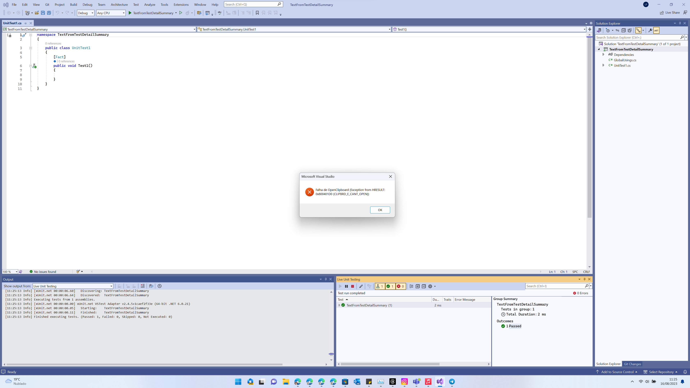

# TextFromTestDetailSummary

This project serves to reproduce the error reported on [Copying text from Test Detail Summary throws exception on dialog](https://developercommunity.visualstudio.com/t/Copying-text-from-Test-Detail-Summary-th/10441176?viewtype=all).

Run a test that fails, select text from Test Detail Summary, then hit Ctrl+C, a dialog will appear `Fail of OpenClipboard (Exception from HRESULT: 0x800401D0 (CLIPBRD_E_CANT_OPEN))`
I need then to click on OK. And continue my work, the selected text is on clipboard, so this is just annoyance.

As seen on this screenshot 